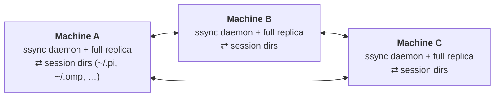

# ssync

**Continuous, peer-to-peer sync of coding-agent session files across your own machines.**

Work with an AI coding agent on your desktop, walk away, and resume the _same_ session on
your laptop — automatically, no manual commands, no server to run.

ssync watches where your agent stores its sessions, keeps them encrypted and in sync across
all your machines over a direct peer-to-peer connection (via [iroh](https://iroh.computer)),
and writes incoming sessions back so the agent can `--resume` them anywhere.

## Status

Early. Supports the **pi** and **omp** agents (lossless merge) plus **Claude Code**
and **Codex** (newest-wins until their formats are verified append-only), under
active construction. See [docs/DECISIONS.md](docs/DECISIONS.md) for the design rationale.

## What it is / isn't

- ✅ Syncs session **files** across your machines, peer-to-peer, automatically.
- ✅ Encrypted at rest by default ([age](https://github.com/FiloSottile/age)).
- ✅ Self-converging: diverged append-only sessions are merged losslessly, and
  deletions propagate.
- ✅ No central server, no VPS, no relay you have to run. Internet sync uses iroh's free
  public discovery + hole-punching (which only ever sees ciphertext).
- ❌ Not a live "continue a running process on another machine" tool.
- ❌ Not an agent orchestrator or dashboard (see cctl, ccmanager, etc. for that).

## How it works

Every machine runs the same daemon — there is no hub. Each daemon watches the agent's
session directory, encrypts changed sessions with age, and publishes them into a shared,
self-converging index ([iroh-docs](https://github.com/n0-computer/iroh-docs)) with the file
contents moved as content-addressed blobs ([iroh-blobs](https://github.com/n0-computer/iroh-blobs)).
Sessions are identified by the agent's own session id, so "the same session" is coherent on
every machine. Peers connect either from a one-off pairing ticket (standalone) or
automatically when managed by [clan](https://clan.lol) (which distributes a shared
namespace secret and each machine's node-id), then sync directly via iroh discovery and NAT
hole-punching.



No hub, no server: the machine-to-machine links are direct p2p sync carrying only
age ciphertext. Every daemon holds a full replica, adding a machine is just one more
identical daemon joining the namespace, and the swarm self-meshes via gossip
regardless of which machine you paired through.

## Install

The same daemon, three ways to get it:

1. **From source** (no nix required) — a plain Rust workspace. The only runtime
   dependency is `age`/`age-keygen` ≥ 1.3 (post-quantum support) on `PATH`:

   ```bash
   cargo build --release && ./target/release/ssync --help
   ```

   With nix (flakes), the package wraps the `age` dependency for you:

   ```bash
   nix run github:fosskar/ssync -- --help      # try it
   nix profile install github:fosskar/ssync   # imperative install
   ```

   Declaratively, add `inputs.ssync.url = "github:fosskar/ssync";` to your flake
   and use `inputs.ssync.packages.<system>.default` — or better, use a module:

2. **NixOS or home-manager module** (flake input, as above) — the same binary as
   a hardened systemd service; the module writes the config from nix options,
   you pair once with a ticket.
3. **[clan](https://clan.lol) service** — wraps the NixOS module and additionally
   generates and distributes every key via clan.vars: no tickets, no manual
   pairing, just a peer list.

Step-by-step instructions for all three: **[docs/setup.md](docs/setup.md)**.

## Quick start

ssync encrypts with age keys: either one **shared key** on all your machines, or a
**key per machine** with each peer's recipient listed in `recipients` (enables
per-device revocation). Each synced project must live at the **same absolute path**
everywhere (see [docs/identity.md](docs/identity.md)).

**With [clan](https://clan.lol):** just list the peer machines — the clan service generates
a per-machine age key (peers encrypt to each other's recipients), a shared namespace secret
and each machine's node-id, so peers auto-connect with no `ticket`/`join`.

**Standalone** (from source / NixOS / home-manager), pair once with a ticket:

```bash
# first machine
ssync init          # writes config.toml, generates the age key
ssync daemon        # creates a namespace and starts syncing
ssync ticket        # prints this machine's pairing ticket

# second machine (same age key copied over, or its recipient added to `recipients`)
ssync init
ssync join '<ticket-from-first-machine>'
ssync daemon        # joins the namespace and syncs
```

Run `ssync daemon` on each machine (the Nix modules do this as a hardened systemd service).
Full instructions: [docs/setup.md](docs/setup.md). Pairing details: [docs/pairing.md](docs/pairing.md).

```bash
ssync status        # namespace, session count, conflicts
ssync conflicts     # sessions that diverged across machines
ssync cleanup --keep 3m           # list sessions older than 3 months (dry run)
ssync cleanup --keep 3m --apply   # delete them; propagates to all peers
```

`cleanup` selects by session *creation* time (from the filename; mtime is
meaningless — the engine rewrites files on sync), optionally per agent
(`--agent pi`), by date (`--before 2026-06-08`), or sessions never given a
title (`--unnamed`). It refuses to delete an agent's last session, since that
deletion would not propagate (the empty-dir safety guard).

## Security

Sessions often contain secrets (API keys, file contents). ssync encrypts every session at
rest with age before it ever leaves the machine, so peers and any relay see only ciphertext.
See [docs/threat-model.md](docs/threat-model.md). Sessions are encrypted with post-quantum hybrid keys by default
(ML-KEM-768 + X25519, via `age-keygen -pq`). The NixOS module runs the daemon under a strict
systemd sandbox ([docs/DECISIONS.md](docs/DECISIONS.md) §12).

## License

MIT. See `LICENSE`.
